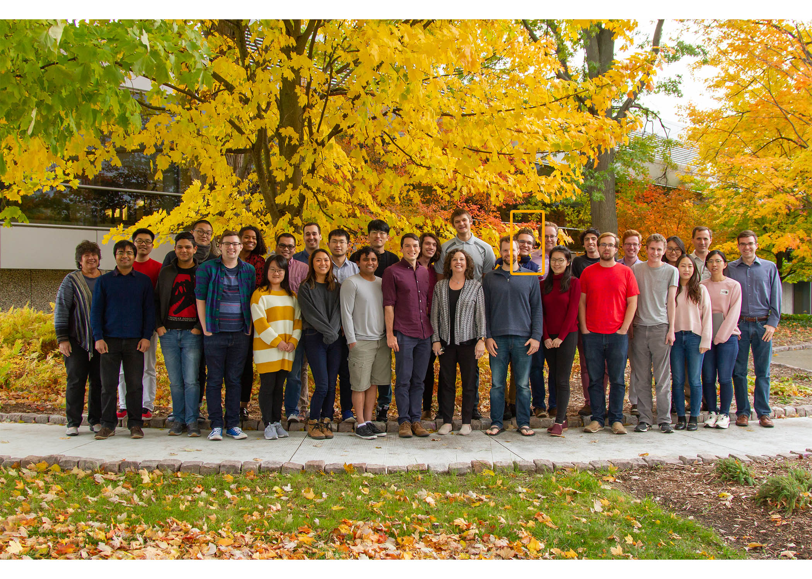
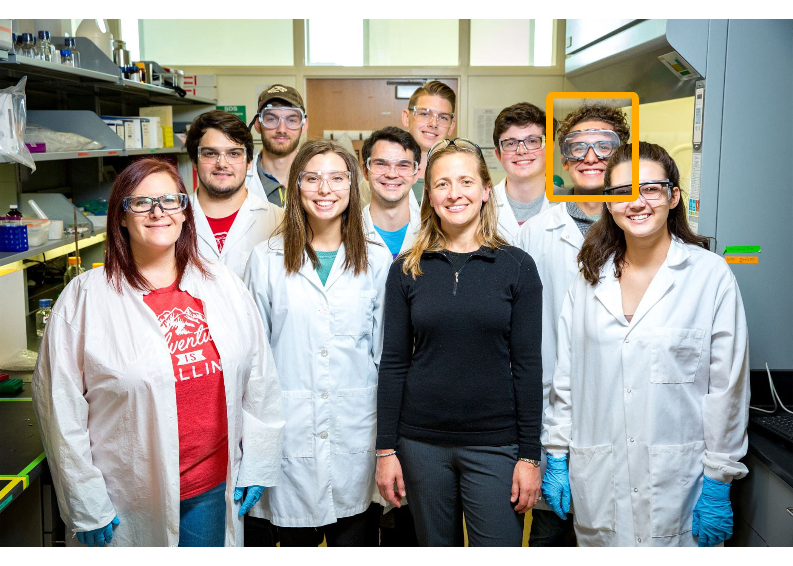
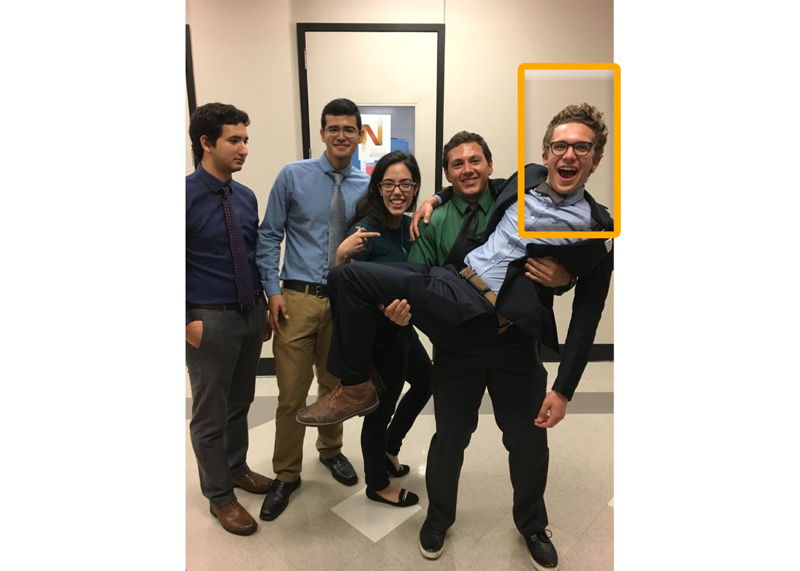
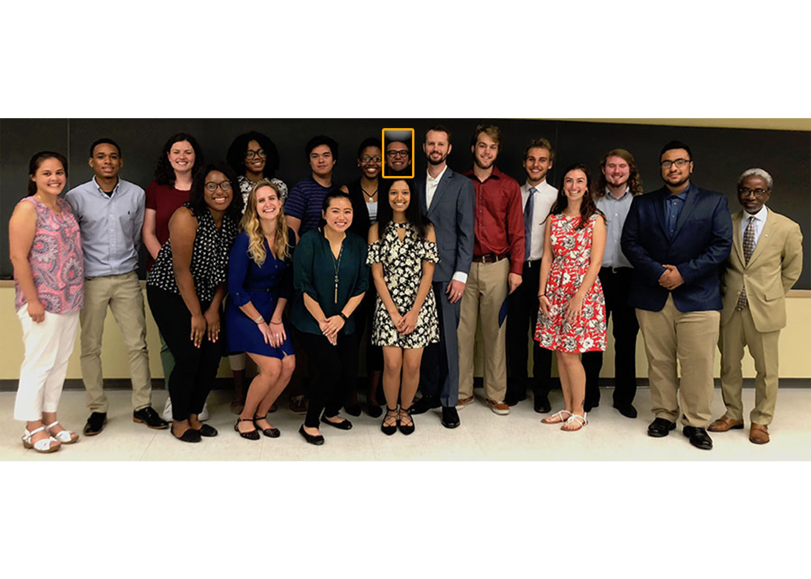

I am a Chemical Engineering PhD student at the University of Michigan working in Professor [Sharon Glotzer's Group][1]. Here I work on a variety of projects including, how binary 2D assemblies of particles make porous host-guest networks, how some cell shapes settle into ordered structures, how charged nanoparticles self-assemble, how DNA nano-objects self-assemble, and how particles move through porous media (visit my **research interests** page to learn more). In addition to working on these research projects I also work as a developer and maintainer of codes in the group, but the bulk has been dedicated to the group's geometry package, [coxeter][5]. 

I went to undergrad at the University of Arkansas where I received my Bachelor's of Science in Chemical Engineering. During that time I worked in the lab of Professor [Lauren Greenlee][2]. 

I also had two REUs through the National Science Foundation, one at the University of Texas, Austin, under Professor [John Ekerdt][3],

and another at Tulane University under Professor [Hank Ashbaugh][4].

I owe a lot to these undergraduate experiences, Dr. Greenlee for always believing in me and supporting my interests, Dr. Ekerdt for making me believe I could go to a top tier research university and Hank for making me believe I could be a theorist someday. Go check out their websites they do incredible and interesting work. 

[1]:https://glotzerlab.engin.umich.edu/home/
[2]:https://sites.uark.edu/greenlee/
[3]:https://sites.utexas.edu/ekerdtgroup/dr-john-g-ekerdt/
[4]:https://hanka40.wixsite.com/hankpage
[5]:https://coxeter.readthedocs.io/en/latest/
